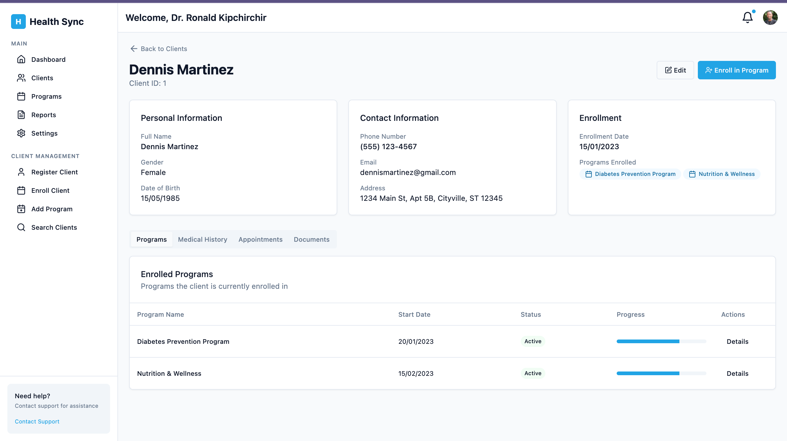

# 🧑‍💼 User Manual – HealthSync

## 🚀 Getting Started with the Health Information System

### 🔐 Logging In

1. Navigate to the login page:  
   [login]()
2. Enter your **username** and **password**
3. Click the **"Log In"** button

> 📷 *Login Screen Preview

---

## 📊 Dashboard Overview

After logging in, you'll see the main **Dashboard**, which includes:

- ✅ Summary statistics of active clients and programs  
- 🕒 Recent activity feed  
- ⚡ Quick action buttons for common tasks  

> 📷 *Dashboard 

---

## 👥 Managing Clients

### 🔍 Searching for Clients

1. Click **"Clients"** in the sidebar
2. Use the search form to filter by:
   - Client name
   - Program enrollment
   - Other demographics (age, gender, etc.)
3. Click **"Search"** to view matching results

> 📷 *Client Search Interface*

---

### 📝 Registering a New Client

1. Navigate to: **Clients > Register New Client**
2. Fill in all **required fields** (marked with `*`)
3. Optionally add:
   - Contact information
   - Medical history
   - Supporting documents
4. Click **"Register Client"** to save the new record

> 📷 *Client Registration Form*

---

### 🔎 Viewing Client Details

1. Search and locate the client in the list
2. Click **"View"** next to the client record
3. The client profile shows:
   - Personal information
   - Current program enrollments
   - Medical history (if authorized)
   - Notes and attached documents

> 📷 *Client Profile View*

---

## 🩺 Program Management

### ➕ Creating a Health Program

1. Navigate to: **Programs > Create Program**
2. Fill in:
   - **Program Name**
   - **Description**
   - **Eligibility Criteria**
   - **Duration and Scheduling**
3. Click **"Create Program"** to finalize

> 📷 *Create Program Form*

---

### 🧾 Enrolling Clients in Programs

1. Navigate to: **Clients > Enroll Client**
2. Search for the client by **name or ID**
3. Select the appropriate **program**
4. Set the **enrollment date** and optional notes
5. Confirm **client consent**
6. Click **"Enroll Client"** to complete the process

> 📷 *Client Enrollment Screen*

---

## 📈 Generating Reports

1. Go to **Reports** in the sidebar
2. Choose from report types:
   - Program Enrollment Statistics
   - Client Demographics
   - Age Distribution
3. Apply filters to customize the output
4. Export results to **CSV** or **PDF**

> 📷 *Reports Dashboard*

---

[🔝 Back to Top](https://github.com/McRonaah/HealthSync/blob/main/Documentations/UserManual.md)
